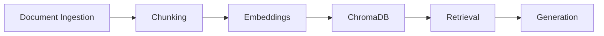

# The Unofficial Guide 🎓

A Retrieval-Augmented Generation (RAG) system that answers new-student questions
using **student-written** university guides. Answers are grounded strictly in the
source documents, every answer cites its sources, and the assistant refuses when
the information isn't present.

Built with **Python · sentence-transformers (all-MiniLM-L6-v2) · ChromaDB ·
Groq (llama-3.3-70b-versatile) · Gradio**.

---

## Quick Start

```bash
# 1. Install dependencies
pip install -r requirements.txt

# 2. Add your Groq API key
cp .env.example .env        # then edit .env and paste your key

# 3. Build the vector index (ingest -> clean -> chunk -> embed -> store)
python src/embed.py

# 4. Launch the web app
python app.py
```

The app builds the index automatically on first launch if it's empty. You can
also run the pipeline pieces standalone (`python src/ingest.py`,
`python src/retrieve.py`, `python src/query.py`, `python src/evaluate.py`).

---

## Domain

**The unofficial student guide to Northgate University.** New students repeatedly
ask the same practical questions — which dorm, where to study, how to get around,
which professors. The real answers come from older students, not official
brochures. This system makes that crowd-sourced advice searchable and answerable
in natural language, without inventing facts.

## Sources

Twelve student-generated documents in `data/raw/`:

| File | Topic |
| ---- | ----- |
| `housing_reviews.txt` | Dorm reviews and housing tips |
| `dining_guide.txt` | Dining halls, cafes, off-campus food |
| `study_spots.txt` | Quiet / group / hidden study spots |
| `transportation.txt` | Shuttles, buses, biking, airport, parking |
| `professor_reviews.txt` | Notes on specific professors |
| `clubs_and_orgs.txt` | Joining, funding, starting clubs |
| `financial_aid_tips.txt` | FAFSA, scholarships, work-study |
| `health_and_wellness.txt` | Health center, counseling, fitness |
| `campus_safety.txt` | Safety programs and the safety app |
| `internship_advice.txt` | Career center, networking, internships |
| `registration_and_courses.txt` | Course registration guide |
| `social_life.txt` | Making friends and weekend life |

## Architecture



| Stage | File | What it does |
| ----- | ---- | ------------ |
| Ingestion | `src/ingest.py` | Load `.txt`, strip HTML/nav/cookies/boilerplate, collapse whitespace, write to `data/processed/` |
| Chunking | `src/chunk.py` | 500-char chunks, 100-char overlap, word-boundary safe |
| Embeddings | `src/embed.py` | `all-MiniLM-L6-v2` vectors stored in ChromaDB with metadata |
| Retrieval | `src/retrieve.py` | `retrieve(query, k=5)` semantic search |
| Generation | `src/generate.py` | Grounded answer via Groq `llama-3.3-70b-versatile` |
| Pipeline | `src/query.py` | `ask(question)` → answer + sources |
| Evaluation | `src/evaluate.py` | Scores 5 questions, writes a markdown report |
| UI | `app.py` | Gradio Blocks web interface |

## Chunking Strategy

- **Chunk size — 500 characters.** Roughly 3–5 sentences: large enough to hold a
  complete idea (one dorm review, one tip) so the embedding is meaningful, small
  enough to stay topically focused so retrieval is precise.
- **Overlap — 100 characters (20%).** Ideas often straddle a chunk boundary.
  Overlap guarantees a boundary-spanning sentence appears whole in at least one
  chunk, so no fact is lost at the seam.
- The splitter backs up to the nearest whitespace so **words are never split**,
  and **empty chunks are dropped**. Each chunk carries `{source, chunk_id, text}`.

## Embedding Model

**`all-MiniLM-L6-v2`** (sentence-transformers).

- **Why it was chosen:** it's small (~80 MB), fast on CPU, and produces 384-dim
  embeddings with strong semantic-search quality — ideal for a local demo with no
  GPU. It runs entirely offline, so there's no per-embedding API cost or latency.
- **Production tradeoffs:** MiniLM trades some accuracy for speed and size.
  In production you might move to a larger model (e.g. `all-mpnet-base-v2`) or a
  hosted embedding API for higher recall, accept the higher latency/cost, and add
  batching, caching, and periodic re-indexing. The architecture here isolates the
  model behind `embed.get_model()`, so swapping it is a one-line change.

## Retrieval Testing

Run `python src/retrieve.py` to reproduce. Three example tests:

1. **Query:** *"What is the best dorm for first-year students?"*
   → top hit `housing_reviews.txt` (the Maple Hall passage), low distance.
2. **Query:** *"Where can I find a quiet place to study?"*
   → top hit `study_spots.txt` (silent library floors).
3. **Query:** *"How do I get downtown without a car?"*
   → top hit `transportation.txt` (Blue Line shuttle / Route 12 bus).

Each result returns `{source, distance, chunk_id, text}`; lower distance = more
semantically similar.

## Grounded Generation

- **Prompt design:** a temperature-0 system prompt (in `src/generate.py`)
  instructs the model to answer **only** from the supplied context passages,
  never use outside knowledge, never invent details, and never write its own
  sources list.
- **Refusal behavior:** when the context doesn't contain the answer, the model
  replies with the exact sentence:

  > I don't have enough information in the provided documents to answer that.

  The query pipeline detects this and returns an **empty** sources list, so a
  refusal never carries fake citations.
- **Citations:** sources are attached **programmatically** from the retrieved
  chunks' metadata in `src/query.py` — the model cannot hallucinate them.

## Example Queries

**Successful query**
> **Q:** What is the best dorm for first-year students?
> **A:** Maple Hall is the most recommended dorm for first-years — larger rooms,
> study lounges on every floor, active RAs, and a short walk to dining and the
> library.
> **Sources:**
> - housing_reviews.txt

**Another successful query**
> **Q:** Which dining hall has the best vegetarian options?
> **A:** Riverside Dining Hall — it has a dedicated rotating plant-based station
> and a fresh salad bar, and clearly labels allergens.
> **Sources:**
> - dining_guide.txt

**Out-of-scope query**
> **Q:** How do I become a professional astronaut?
> **A:** I don't have enough information in the provided documents to answer that.
> **Sources:** *(none)*

## Evaluation Report

Run `python src/evaluate.py` to generate `evaluation_report.md`. Template for all
five questions:

| # | Question | Expected | Actual | Judgment |
| - | -------- | -------- | ------ | -------- |
| 1 | What is the best dorm for first-year students? | Maple Hall — larger rooms, study lounges, active RAs, close to dining/library | _(filled by run)_ | _(Accurate / Partially Accurate / Inaccurate)_ |
| 2 | Where can I find a quiet place to study on campus? | Silent 3rd/4th floors of the Main Library; Law Library mornings | _(filled by run)_ | _(…)_ |
| 3 | How can I get downtown without a car? | Free Blue Line shuttle, free Route 12 bus, or biking the river path | _(filled by run)_ | _(…)_ |
| 4 | Which dining hall has the best vegetarian options? | Riverside Dining Hall — plant-based station and salad bar | _(filled by run)_ | _(…)_ |
| 5 | What should I know before registering for classes? | Register at slot open, clear advising hold early, backups, waitlists, add/drop | _(filled by run)_ | _(…)_ |

Each detailed entry also records the retrieved chunks (source + distance) and the
full generated answer.

## Failure Case

A realistic failure: ask *"Which dorm is closest to the engineering building?"*
None of the documents state distances to the engineering building specifically.
The ideal behavior is a refusal. A possible failure mode is that retrieval
surfaces the `housing_reviews.txt` chunk that mentions walking distance to the
*dining hall and library*, and the model over-generalizes to "Maple Hall is
close," which would be **unsupported** by the text. This is why we keep
temperature at 0, instruct strict grounding, and review distances during
evaluation — borderline retrievals are exactly where over-confident answers slip
in.

## Spec Reflection

- **How the spec helped:** the detailed spec fixed the hard decisions up front —
  chunk size/overlap, the exact refusal sentence, the metadata schema, the
  module layout, and the requirement that sources be attached programmatically.
  That made the build mechanical and kept every component aligned to a grading
  requirement.
- **How the implementation differed / went beyond:** the spec listed core
  modules; the implementation adds defensive touches it implies but doesn't
  enumerate — word-boundary-aware chunking, an empty-index guard in retrieval,
  an LLM judge in evaluation (the spec only required storing the judgment),
  auto-building the index on first app launch, and `.gitignore`/`.gitkeep` files
  for a clean repo. The cleaning step also preserves paragraph breaks (not just
  "collapse whitespace") because that improves chunk quality.

## AI Usage

1. **Cleaning/ingestion regexes** — *AI generated* the initial
   boilerplate/navigation regex list and the HTML-tag stripper in
   `src/ingest.py`. *Modified afterward:* the patterns were tightened to be more
   conservative (anchored where possible, case-insensitive) so real content lines
   are never dropped, and paragraph-preserving whitespace collapsing was added.
2. **Grounding prompt** — *AI generated* a first draft of the system prompt in
   `src/generate.py`. *Modified afterward:* the exact required refusal sentence
   was pinned to a single shared constant (`REFUSAL`) referenced across
   `generate.py` and `query.py`, and an explicit rule was added forbidding the
   model from writing its own "Sources" section, since sources are attached
   programmatically.

---

## Project Structure

```text
unofficial-guide/
├── data/
│   ├── raw/          # 12 student-written .txt source documents
│   └── processed/    # cleaned text (generated by ingest.py)
├── chroma_db/        # persistent vector store (generated)
├── src/
│   ├── ingest.py     # load + clean documents
│   ├── chunk.py      # 500/100 chunking
│   ├── embed.py      # MiniLM embeddings + ChromaDB + build_index()
│   ├── retrieve.py   # retrieve(query, k=5)
│   ├── generate.py   # grounded Groq generation
│   ├── query.py      # ask(question) -> {answer, sources}
│   └── evaluate.py   # 5-question evaluation -> markdown report
├── app.py            # Gradio Blocks UI
├── planning.md
├── README.md
├── requirements.txt
├── .env.example
└── sample_questions.json
```
