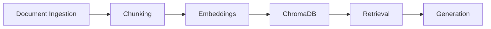

# Planning — The Unofficial Guide

A planning document for a Retrieval-Augmented Generation (RAG) system that
answers new-student questions using student-written guides.

## Domain

**The unofficial student guide to Northgate University.** Incoming and current
students constantly ask the same practical questions — which dorm to pick, where
to study, how to get around, which professors to take — and the real answers
live in the heads of older students, not in official brochures. This system
collects that crowd-sourced, student-written advice and makes it searchable and
answerable in natural language, while staying strictly grounded in the source
documents so it never invents campus "facts."

## Documents

Twelve student-generated `.txt` documents live in `data/raw/`:

1. `housing_reviews.txt` — dorm-by-dorm reviews and housing tips
2. `dining_guide.txt` — dining halls, cafes, and off-campus food
3. `study_spots.txt` — quiet, group, and hidden study locations
4. `transportation.txt` — shuttles, buses, biking, airport, parking
5. `professor_reviews.txt` — student notes on specific professors
6. `clubs_and_orgs.txt` — joining, funding, and starting clubs
7. `financial_aid_tips.txt` — FAFSA, scholarships, work-study, emergencies
8. `health_and_wellness.txt` — health center, counseling, fitness
9. `campus_safety.txt` — safety programs, the safety app, theft prevention
10. `internship_advice.txt` — career center, networking, internships
11. `registration_and_courses.txt` — course registration survival guide
12. `social_life.txt` — making friends and weekend life

## Chunking Strategy

- **Chunk size:** 500 characters
- **Overlap:** 100 characters (20%)
- **Reasoning:** 500 characters holds a complete thought (one dorm review, one
  tip) — big enough for a meaningful embedding, small enough to stay topically
  focused. A 20% overlap ensures any idea that straddles a boundary still appears
  whole in at least one chunk. The chunker also backs up to whitespace so words
  are never split, and drops empty chunks.
- Each chunk carries metadata `{source, chunk_id, text}`.

## Retrieval Approach

- Embed both documents and queries with `all-MiniLM-L6-v2`
  (sentence-transformers), normalized for cosine distance.
- Store vectors + metadata in a persistent **ChromaDB** collection.
- `retrieve(query, k=5)` runs nearest-neighbour search and returns each chunk's
  text, `source`, and `distance` (lower = more similar).

## Evaluation Plan

Run `src/evaluate.py` over five fixed questions, record the retrieved chunks and
the generated answer, and have an LLM judge label each as
**Accurate / Partially Accurate / Inaccurate**. Output is a markdown report.

The five evaluation questions and expected answers:

1. **What is the best dorm for first-year students?**
   *Expected:* Maple Hall — larger rooms, study lounges, active RAs, close to
   dining and the library.
2. **Where can I find a quiet place to study on campus?**
   *Expected:* The silent 3rd/4th floors of the Main Library; the Law Library in
   the mornings.
3. **How can I get downtown without a car?**
   *Expected:* The free Blue Line shuttle, the free-for-students Route 12 bus, or
   biking the river path (~10 min).
4. **Which dining hall has the best vegetarian options?**
   *Expected:* Riverside Dining Hall — dedicated rotating plant-based station and
   fresh salad bar.
5. **What should I know before registering for classes?**
   *Expected:* Register the moment your slot opens, see your advisor early to
   clear the hold, prepare backups, use waitlists, and use the add/drop window.

## Anticipated Challenges

1. **Over-refusal vs. hallucination balance** — too strict a prompt makes the
   model refuse answerable questions; too loose lets it import outside knowledge.
   Mitigation: a temperature-0, explicitly-grounded prompt plus an exact refusal
   sentence, tuned against the evaluation set.
2. **Chunk boundaries splitting answers** — a fact split across two chunks could
   be retrieved only partially. Mitigation: 100-char overlap and word-boundary-
   aware splitting.
3. **Retrieval misses (wrong or weak neighbours)** — short queries may not match
   the phrasing in the documents. Mitigation: retrieve top-k=5 to widen recall,
   normalized cosine distance, and report distances during evaluation to spot
   weak matches.
4. **Source attribution integrity** — the model could fabricate citations.
   Mitigation: sources are attached programmatically from retrieved metadata, not
   produced by the model.

## AI Tool Plan

Specific prompts used while building the system (see README "AI Usage" for what
was kept vs. modified):

- **Ingestion:** *"Write a Python text-cleaning function using only the standard
  library that strips HTML tags, drops navigation/cookie/boilerplate lines, and
  collapses whitespace while preserving paragraph structure."*
- **Chunking:** *"Implement a 500-char / 100-overlap character chunker that never
  splits words and never emits empty chunks, attaching {source, chunk_id, text}
  metadata, with comments explaining the size and overlap choices."*
- **Embeddings:** *"Show how to embed text with sentence-transformers
  all-MiniLM-L6-v2 and store vectors + metadata in a persistent ChromaDB
  collection using cosine distance."*
- **Retrieval:** *"Write retrieve(query, k=5) that queries a Chroma collection
  and returns each result's source, distance, and text."*
- **Generation:** *"Write a strict grounding system prompt for a Groq
  llama-3.3-70b-versatile chat call that answers only from provided context and
  refuses with an exact sentence when the answer is absent."*

## Architecture

